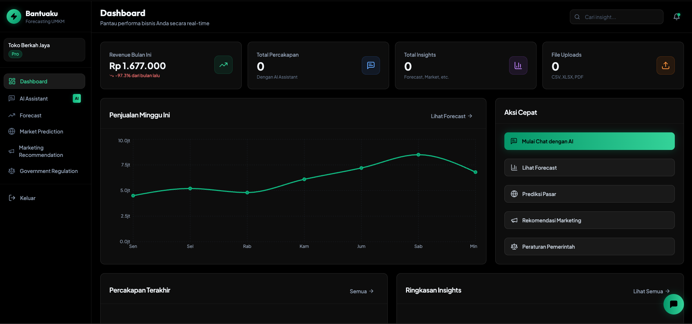
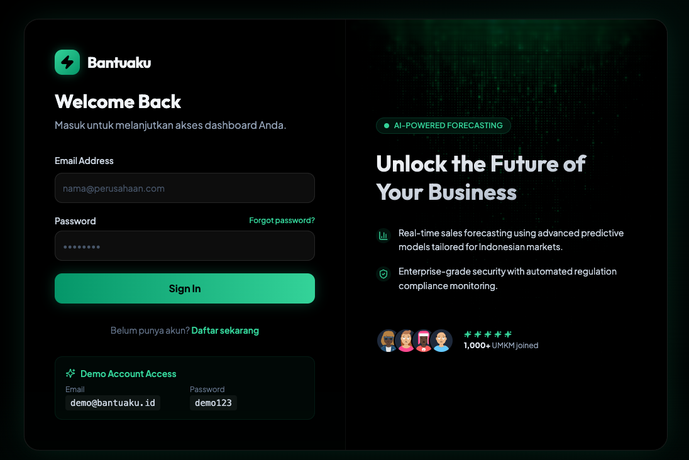
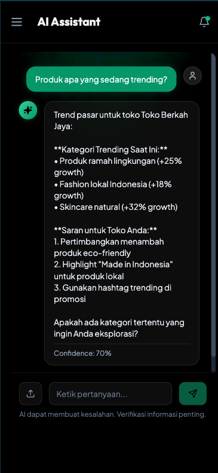

# Bantuaku SaaS

**AI-Chat-First Forecasting Assistant untuk UMKM Indonesia**


## 🎯 Overview

Bantuaku adalah platform SaaS yang membantu UMKM Indonesia membuat keputusan bisnis berbasis data melalui **AI chat sebagai interface utama**. Platform ini mengumpulkan informasi bisnis secara conversational dan menghasilkan insights praktis.

### 🖼️ Visual Showcase

<div align="center">
  <h3>✨ Modern "Neon Finance" UI Design ✨</h3>
  
  <table>
    <tr>
      <td align="center">
        <b>Dashboard</b><br/>
        
        <p><small>Comprehensive business overview with KPIs, charts, and quick actions</small></p>
      </td>
      <td align="center">
        <b>Login Page</b><br/>
        
        <p><small>Beautiful split-screen design with tech animations</small></p>
      </td>
    </tr>
    <tr>
      <td colspan="2" align="center">
        <b>Mobile Chat Experience</b><br/>
        
        <p><small>Floating chat widget with seamless mobile navigation</small></p>
      </td>
    </tr>
  </table>
</div>

## ✨ Fitur Utama

### 🤖 AI Assistant Chat
- **Conversational Interface** - Chat dengan AI untuk mengumpulkan data bisnis (powered by Kolosal.ai)
- **Floating Chat Widget** - Akses cepat AI Assistant dari halaman manapun
- **File Upload Support** - Upload CSV, XLSX, atau PDF untuk ekstraksi data otomatis (OCR powered by Kolosal.ai)
- **Conversation History** - Riwayat percakapan tersimpan dan dapat diakses kapan saja

### 📊 Forecast
- **Sales Projections** - Proyeksi penjualan 30/60/90 hari ke depan berdasarkan data penjualan yang diinput user
- **Interactive Charts** - Visualisasi trend historis vs prediksi AI dengan AreaChart
- **Confidence Metrics** - Tingkat akurasi prediksi ditampilkan dengan jelas
- **AI Insights Panel** - Rekomendasi strategis berdasarkan analisis forecast

### 🌍 Market Prediction
- **Local & Global Trends** - Prediksi tren pasar lokal (Indonesia) dan global untuk produk Anda
- **Trending Products** - Daftar produk yang sedang naik daun dengan growth metrics
- **Market Intelligence** - Analisis kompetisi dan peluang pasar
- **Interactive Tabs** - Switch antara analisis lokal dan global dengan mudah

### 📢 Marketing Recommendation
- **Personalized Strategies** - Rekomendasi kampanye marketing yang dipersonalisasi
- **Multi-Channel Approach** - Strategi untuk Social Media, Email, dan Paid Ads
- **Campaign Performance** - Estimasi dampak dan ROI untuk setiap rekomendasi
- **Content Generation** - Generate konten iklan dengan AI

### ⚖️ Government Regulation
- **Compliance Dashboard** - Monitor status kepatuhan bisnis terhadap regulasi terbaru
- **Regulation Alerts** - Notifikasi untuk peraturan urgent yang perlu perhatian
- **Compliance Score** - Skor kepatuhan bisnis dengan breakdown detail
- **Action Items** - Daftar peraturan yang perlu ditindaklanjuti

### 🔔 Smart Notifications
- **Real-time Updates** - Notifikasi untuk forecast selesai, update regulasi, dan tren pasar baru
- **Priority Indicators** - Badge untuk notifikasi urgent dan penting
- **Dark Glass UI** - Desain modern dengan dark glass mode untuk readability optimal

## 🚀 Quick Start

### Prerequisites

- Docker & Docker Compose
- Node.js 20+ (untuk development)
- Go 1.25+ (untuk development)

### Running with Docker

```bash
# Clone repository
git clone https://github.com/your-org/bantuaku.git
cd bantuaku

# Start all services
make dev

# Or manually:
docker-compose up --build
```

Aplikasi akan berjalan di:
- **Frontend**: http://localhost:3000
- **Backend API**: http://localhost:8080
- **PostgreSQL**: localhost:5432
- **Redis**: localhost:6379

### Demo Account

```
Email: demo@bantuaku.id
Password: demo123
```

## 📁 Project Structure

```
bantuaku/
├── backend/                    # Go backend API
│   ├── config/                 # Configuration
│   ├── handlers/               # HTTP handlers
│   │   ├── chat.go            # Chat & conversation handlers
│   │   ├── files.go           # File upload handlers
│   │   ├── insights.go        # Insights generation handlers
│   │   ├── dashboard.go       # Dashboard summary handler
│   │   └── companies.go       # Company profile handlers
│   ├── middleware/             # Auth, CORS, logging
│   ├── models/                 # Data models
│   │   ├── company.go         # Company & CompanyProfile
│   │   ├── conversation.go    # Conversation & Message
│   │   ├── file_upload.go     # FileUpload & ExtractedData
│   │   ├── data_source.go     # DataSource
│   │   └── insight.go         # Insight & result types
│   ├── services/               # Business logic
│   │   ├── kolosal/           # Kolosal.ai client (Chat & OCR)
│   │   ├── storage/            # Database & Redis
│   │   ├── chat/               # Chat service (TODO)
│   │   ├── ingestion/         # File processing service (TODO)
│   │   ├── forecasting/       # Forecast service (TODO)
│   │   ├── connectors/        # External data connectors (TODO)
│   │   └── insights/          # Insights generation (TODO)
│   └── main.go
├── frontend/                   # React frontend
│   ├── src/
│   │   ├── components/        # UI components
│   │   │   ├── layout/       # Layout components (Sidebar, Header)
│   │   │   ├── chat/         # Chat components (ChatInterface, ChatWidget)
│   │   │   └── ui/           # shadcn/ui components
│   │   ├── pages/             # Page components
│   │   │   ├── AIChatPage.tsx        # AI Chat interface
│   │   │   ├── DashboardPage.tsx     # Dashboard overview
│   │   │   ├── ForecastPage.tsx      # Forecast insights
│   │   │   ├── MarketPredictionPage.tsx  # Market predictions
│   │   │   ├── MarketingPage.tsx     # Marketing recommendations
│   │   │   └── RegulationPage.tsx    # Government regulations
│   │   ├── state/             # State management (Zustand)
│   │   │   ├── auth.ts       # Authentication state
│   │   │   └── chat.ts       # Chat state (messages, loading)
│   │   └── lib/               # Utilities & API clients
│   └── package.json
├── database/
│   └── migrations/            # SQL migrations
│       └── 003_add_chat_tables.sql  # Chat, ingestion, insights tables
├── gh-assets/                 # GitHub assets (screenshots)
│   ├── dashboard.png
│   ├── login-page.png
│   └── mobile-chat.png
├── .docs-private/              # Product & technical documentation
├── docker-compose.yml
├── .env.example                # Environment variables template
└── Makefile
```

## 🔧 Development

### Backend (Go)

```bash
cd backend
go mod download
go run main.go
```

### Frontend (React)

```bash
cd frontend
npm install
npm run dev
```

### Environment Variables

Copy the example environment file and configure it:

```bash
# Copy the example file
cp .env.example .env

# Edit .env and add your values (especially KOLOSAL_API_KEY)
# See .env.example for all available configuration options
```

**Required variables:**
- `KOLOSAL_API_KEY` - Get from https://api.kolosal.ai (optional for basic features)
- `JWT_SECRET` - Generate with: `openssl rand -base64 32` (change from default!)

**Quick setup:**
```env
# Minimum required for local development
KOLOSAL_API_KEY=your-api-key-here
JWT_SECRET=your-secure-secret-here
```

See `.env.example` for complete configuration options and documentation.

## 📚 API Endpoints

### Authentication
- `POST /api/v1/auth/register` - Register new user
- `POST /api/v1/auth/login` - Login

### Chat & Conversations (AI-First Interface)
- `POST /api/v1/chat/start` - Start new conversation
- `POST /api/v1/chat/message` - Send message to AI assistant
- `GET /api/v1/chat/conversations` - List all conversations
- `GET /api/v1/chat/messages` - Get messages from a conversation

### File Uploads
- `POST /api/v1/files/upload` - Upload CSV/XLSX/PDF files (with OCR processing)
- `GET /api/v1/files/{id}` - Get file upload information
- `GET /api/v1/files` - List all file uploads

### Insights (Four Outcome Types)
- `POST /api/v1/insights/forecast` - Generate forecast insights
- `POST /api/v1/insights/market` - Generate market prediction insights
- `POST /api/v1/insights/marketing` - Generate marketing recommendations
- `POST /api/v1/insights/regulation` - Generate government regulation insights
- `GET /api/v1/insights` - Get insight history

### Companies
- `GET /api/v1/companies` - List user's companies
- `GET /api/v1/companies/{id}` - Get company profile (aggregated data)

### Dashboard
- `GET /api/v1/dashboard/summary` - Get dashboard KPIs and summaries

### Legacy AI (Deprecated)
- `POST /api/v1/ai/analyze` - Legacy AI analyze endpoint

## 🎨 Tech Stack

| Component | Technology |
|-----------|-----------|
| Backend | Go 1.25 (net/http) |
| Frontend | React 18 + Vite + TypeScript + Tailwind CSS |
| UI Components | shadcn/ui (Radix UI primitives) |
| State Management | Zustand |
| Charts | Recharts |
| Database | PostgreSQL 18 |
| Cache | Redis 7 |
| AI | Kolosal.ai (Chat & OCR) |
| Deployment | Docker & Docker Compose |

## 📊 Features

### MVP (Hackathon) - AI-Chat-First Architecture

#### ✅ Core Features
- ✅ **AI Chat Interface** - Conversational data collection in Bahasa Indonesia
- ✅ **Floating Chat Widget** - Persistent chat button accessible from any page
- ✅ **File Upload & OCR** - CSV/XLSX/PDF upload with automatic text extraction (Kolosal.ai OCR)
- ✅ **Forecast Insights** - 30/60/90-day sales forecasting with interactive charts
- ✅ **Market Prediction** - Local (Indonesia) and global market trend analysis
- ✅ **Marketing Recommendations** - AI-generated campaign ideas and strategies
- ✅ **Government Regulations** - Indonesia-specific regulatory information with compliance tracking
- ✅ **Company Profile** - Aggregated business data from all sources
- ✅ **Dashboard** - Comprehensive overview with KPIs, charts, and quick actions
- ✅ **Smart Notifications** - Real-time updates with priority indicators

#### ✅ UI/UX Enhancements
- ✅ **"Neon Finance" Design System** - Modern dark theme with emerald accents
- ✅ **Glassmorphism Effects** - Beautiful glass-like UI elements
- ✅ **Responsive Design** - Optimized for desktop and mobile devices
- ✅ **Smooth Animations** - Fade-in, slide transitions, and hover effects
- ✅ **Mobile Navigation** - Hamburger menu with slide-out sidebar
- ✅ **Matrix Background** - Tech animation effects on AI Chat page

### Roadmap
- [ ] **External Data Connectors** - Tokopedia, Shopee, Bukalapak marketplace scraping
- [ ] **Google Trends Integration** - Real-time market trend data
- [ ] **Regulation Scraper** - Automated peraturan.go.id monitoring
- [ ] **Advanced Forecasting** - ML-based time-series forecasting
- [ ] **Mobile App** - React Native mobile application
- [ ] **Billing & Subscriptions** - 3-tier pricing (Free, Pro, Enterprise)
- [ ] **Multi-Company Management** - Support for multiple businesses per user
- [ ] **Export Reports** - PDF/Excel export for forecasts and insights

## 🏗️ Architecture

### High-Level Architecture

```
┌─────────────┐     ┌─────────────────────────────────────┐     ┌─────────────┐
│   Frontend  │────▶│           Backend (Go)              │────▶│  PostgreSQL │
│   (React)   │     │  ┌─────────┐  ┌─────────┐         │     │             │
│             │     │  │  Chat   │  │Ingestion│         │     └─────────────┘
│  - AI Chat  │     │  │ Service │  │ Service │         │
│  - Forecast │     │  └─────────┘  └─────────┘         │     ┌─────────────┐
│  - Market   │     │  ┌─────────┐  ┌─────────┐         │────▶│   Redis     │
│  - Marketing│     │  │Forecast │  │Connector│         │     │   (Cache)   │
│  - Regulation│    │  │ Service │  │ Service │         │     └─────────────┘
│  - Dashboard│     │  └─────────┘  └─────────┘         │
│  - Widget   │     │  ┌─────────┐                       │     ┌─────────────┐
└─────────────┘     │  │ Insights│                       │────▶│ Kolosal.ai  │
                    │  │ Service │                       │     │  (Chat+OCR) │
                    │  └─────────┘                       │     └─────────────┘
                    └─────────────────────────────────────┘
```

### Key Components

- **Chat Service** - Handles AI conversations and message history
- **Ingestion Service** - Processes file uploads (CSV/XLSX/PDF) with OCR
- **Forecast Service** - Generates sales forecasts based on user-provided sales data
- **Connector Service** - External data sources (marketplaces, trends, regulations)
- **Insights Service** - Generates four types of insights (forecast, market, marketing, regulation)

### Frontend Architecture

- **Component-Based** - Reusable UI components with shadcn/ui
- **State Management** - Zustand for global state (auth, chat)
- **Routing** - React Router for navigation
- **Styling** - Tailwind CSS with custom "Neon Finance" theme
- **Charts** - Recharts for data visualization

## 🌟 How It Works

1. **Start Chat** - User begins conversation with AI Assistant (via floating widget or dedicated page)
2. **Data Collection** - AI asks about company, products, location, business model
3. **File Upload** - User can upload CSV/XLSX/PDF files for automatic data extraction
4. **Profile Building** - System builds comprehensive Company Profile from conversations and files
5. **Generate Insights** - User navigates to four outcome pages:
   - **Forecast** - Sales projections with interactive charts (generated if user provides sales data via chat or file upload)
   - **Market Prediction** - Local and global market trends with trending products
   - **Marketing Recommendation** - Campaign ideas and strategies with performance estimates
   - **Government Regulation** - Relevant Indonesian regulations with compliance tracking
6. **Dashboard Overview** - Centralized view of all KPIs, recent conversations, insights, and file uploads

All powered by **Kolosal.ai** for natural language understanding and OCR processing.

## 📝 License

Apache License 2.0 - see [LICENSE](LICENSE) file for details.

## 🔒 Security

We take security seriously. Please see our [Security Policy](.github/SECURITY.md) for details on how to report vulnerabilities.

### Security Scanning

This repository uses automated security scanning:

- **CodeQL** - Static code analysis for security vulnerabilities
- **CodeRabbit** - AI-powered code reviews for security and quality
- **Dependency Review** - PR dependency scanning
- **Security Workflows** - npm audit and Go security scanners

To enable these features:
1. Go to your repository **Settings** → **Code security and analysis**
2. Enable **Code scanning** (CodeQL)
3. Enable **Secret scanning**
4. Install **CodeRabbit** GitHub App (see [CodeRabbit Setup Guide](.github/CODERABBIT_SETUP.md))

All security workflows are configured in `.github/workflows/` and will run automatically on push and pull requests.

**Note**: Dependabot is disabled. Dependency updates are managed manually or through CodeRabbit reviews.

## 🤖 Code Review with CodeRabbit

We use [CodeRabbit](https://coderabbit.ai) for AI-powered code reviews that complement our security scanning tools.

### Features

- **AI-Powered Reviews** - Context-aware code analysis for Go and React/TypeScript
- **Automated PR Summaries** - Quick understanding of changes
- **Line-by-Line Suggestions** - Detailed feedback on code quality and best practices
- **Natural Language Chat** - Ask questions about code changes directly in PRs
- **Cursor IDE Integration** - Real-time code reviews in your editor

### Configuration

CodeRabbit is configured via `.coderabbit.yaml` with:
- Go backend review guidelines (error handling, security, concurrency)
- React/TypeScript frontend review guidelines (performance, accessibility, type safety)
- Path filters to focus on source code
- Integration with ESLint and Gitleaks

See [CodeRabbit Setup Guide](.github/CODERABBIT_SETUP.md) for detailed setup instructions.

## 👥 Team

**Enggan Ngoding, Pecut AI**

Built with ❤️ for IMPHNEN x Kolosal.ai Hackathon 2025

### Team Members

- [@madebyaris](https://github.com/madebyaris)
- [@tobangado69](https://github.com/tobangado69)

---

**Bantuaku** - Membantu UMKM Indonesia tumbuh dengan AI dan data 🇮🇩

---

## 🙏 Acknowledgments

- **Kolosal.ai** - For providing powerful AI chat and OCR capabilities
- **CodeRabbit** - For AI-powered code reviews and quality assurance
- **shadcn/ui** - For beautiful, accessible UI components
- **Recharts** - For elegant data visualization
- **Tailwind CSS** - For rapid UI development
